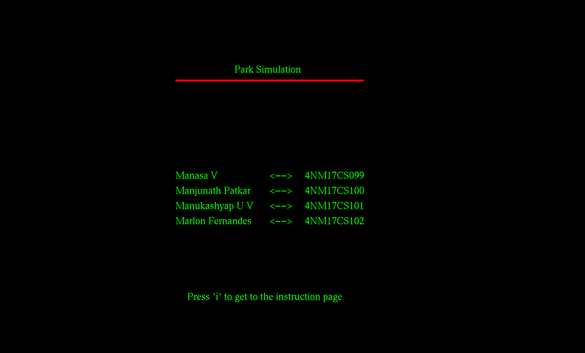
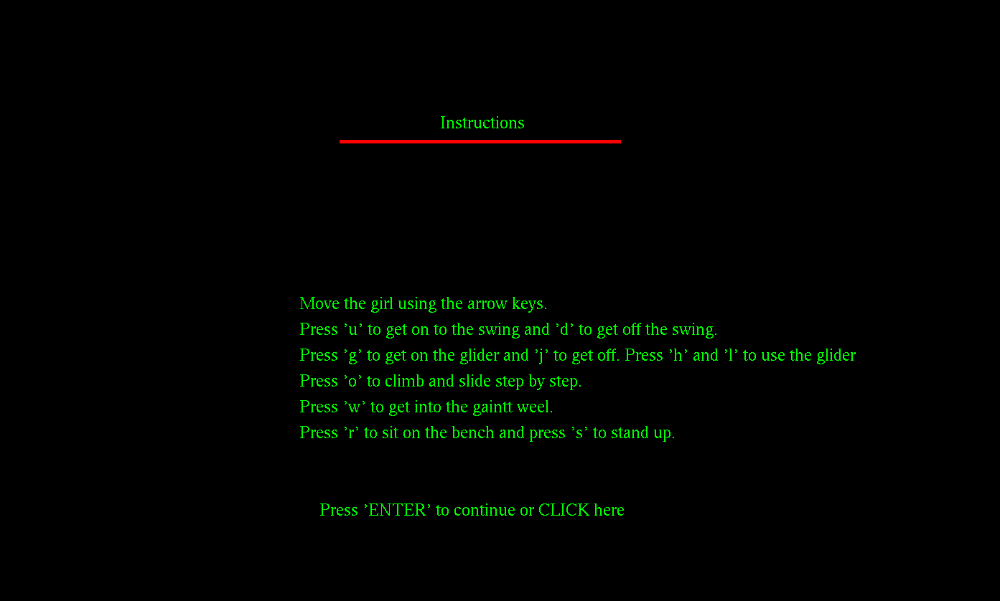
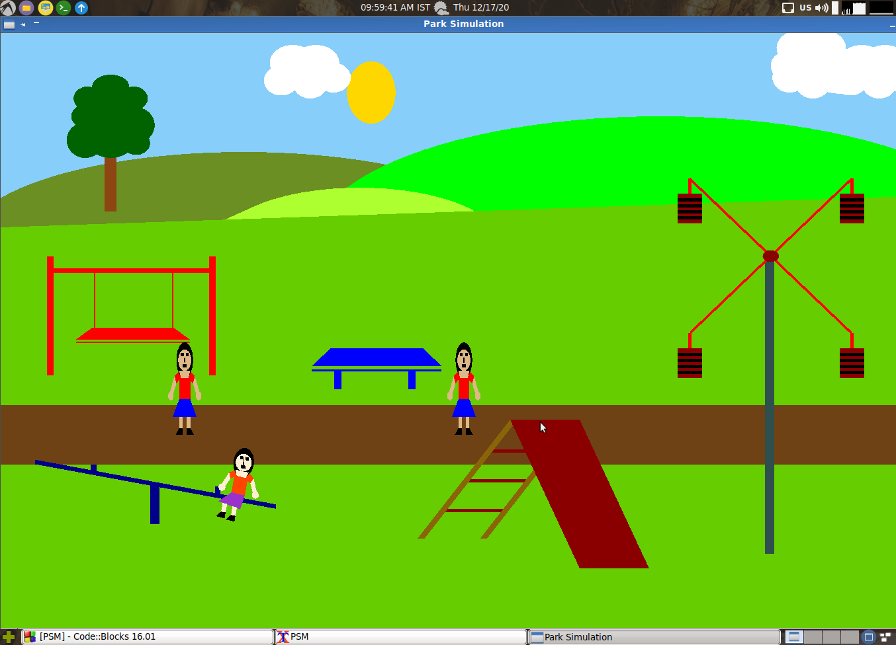
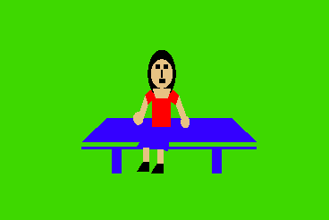
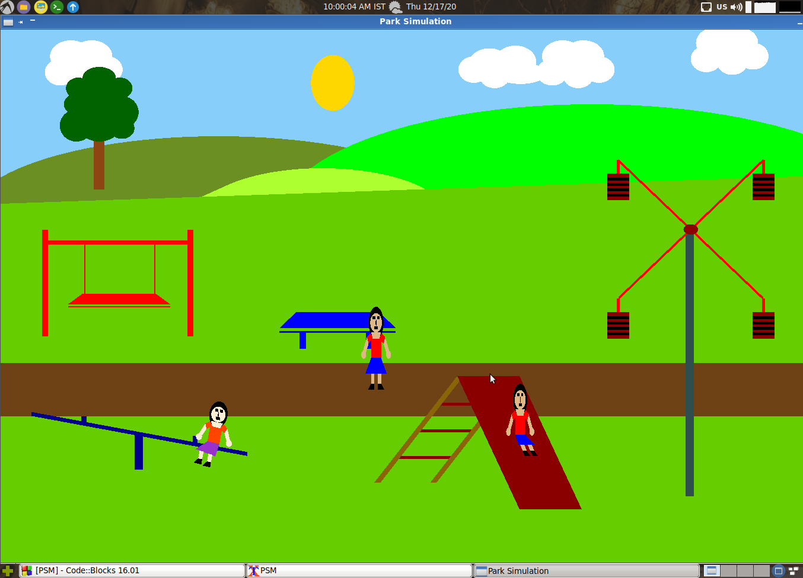
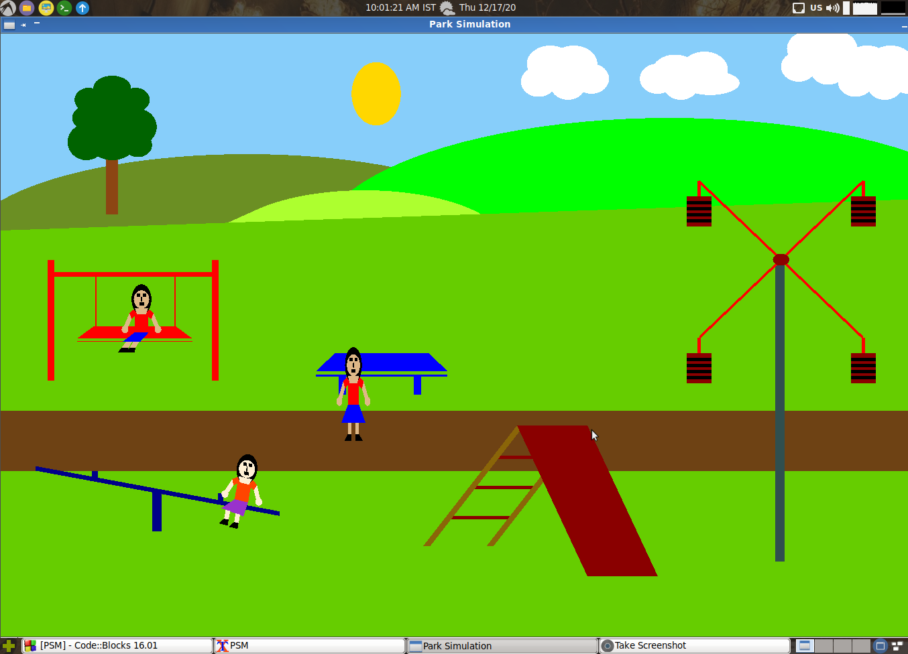
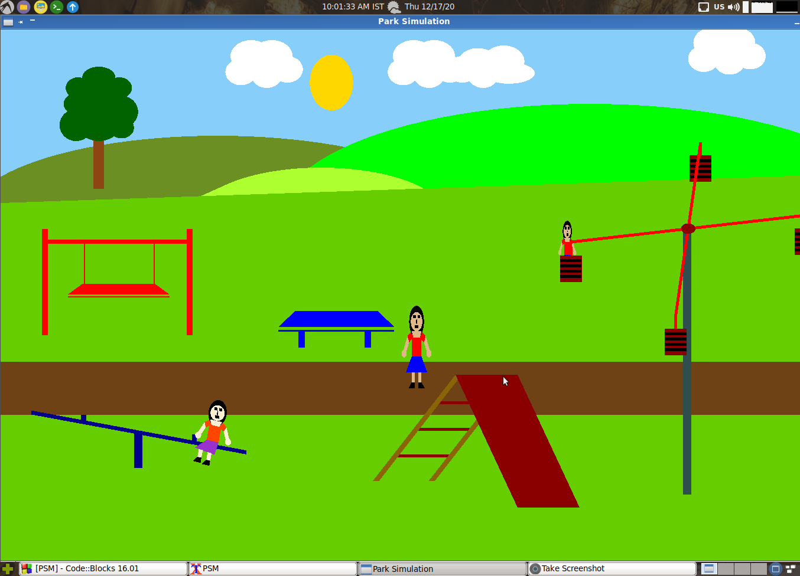
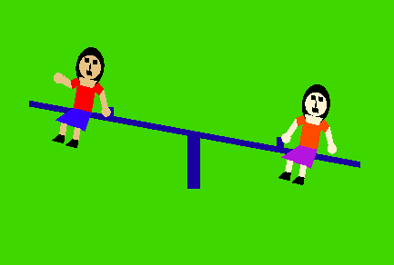

# CG PROJECT

**Team Members**

|USN| Name  |
|--|--|
|4NM17CS099| Manasa V|
|4NM17CS100| Manjunath Patkar|
|4NM17CS101| Manukashyap U V|
|4NM17CS102| Marlon Fernandes|

**Tech used:**

- OpenGL

- CodeBlocks

- Ubuntu

Installing OpenGL on ubuntu and running it through code blocks:

    1 - Installing code blocks :
	    sudo apt install codeblocks
    2 - Installing openGL :
	    sudo apt-get update
	    sudo apt-get install freeglut3-dev
    3 - Change the linker setting in codeblocks : -lGL -lGLU -lglut

Instructions

 - Use the arrow keys to move the girl.
 - Get onto the swing using the 'u' key and get down by using the 'd'.
 - Get onto the glider by using 'g' and get down by using 'j'. Use 'h' and 'l' to use the glider.
 - Climb the slide step by step by pressing 'o'.
 - Get onto the giant weel using 'w'.
 - Press 'r' to get onto the bench and get off by 's'

Screen Shots

